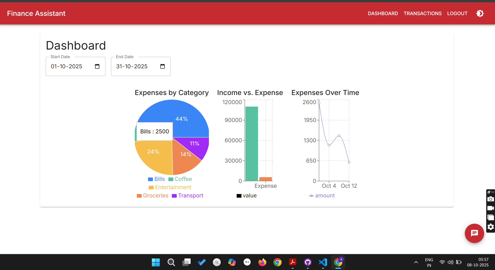
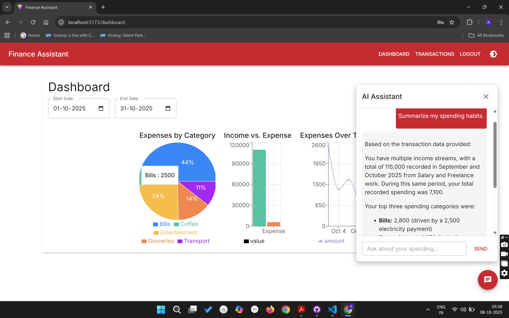
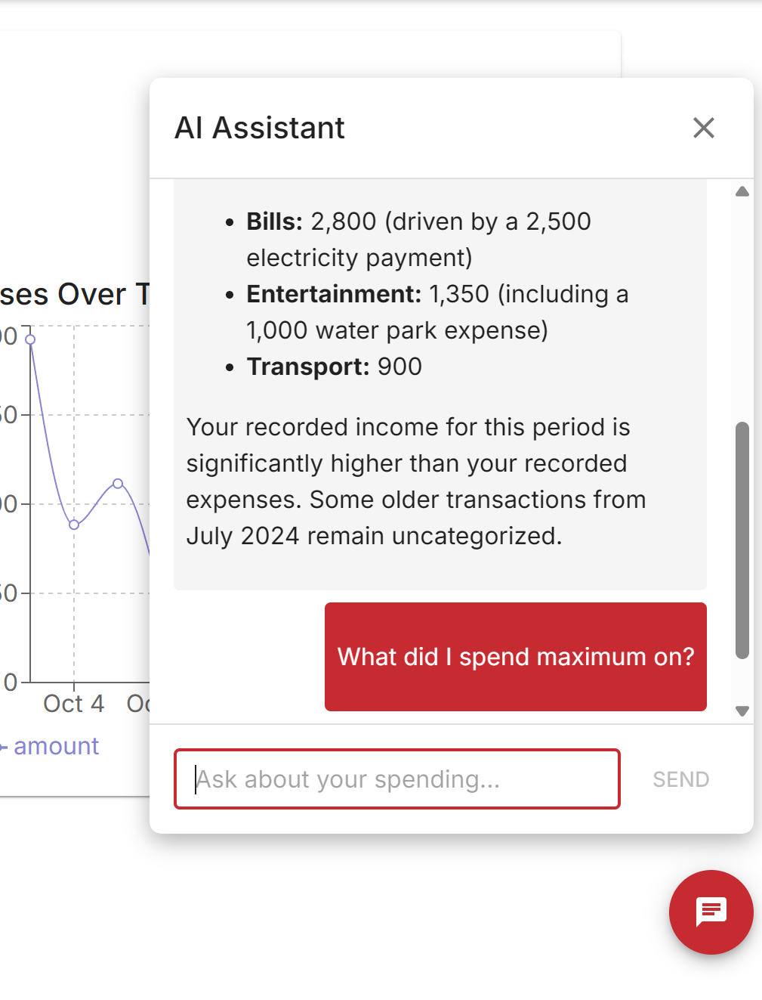
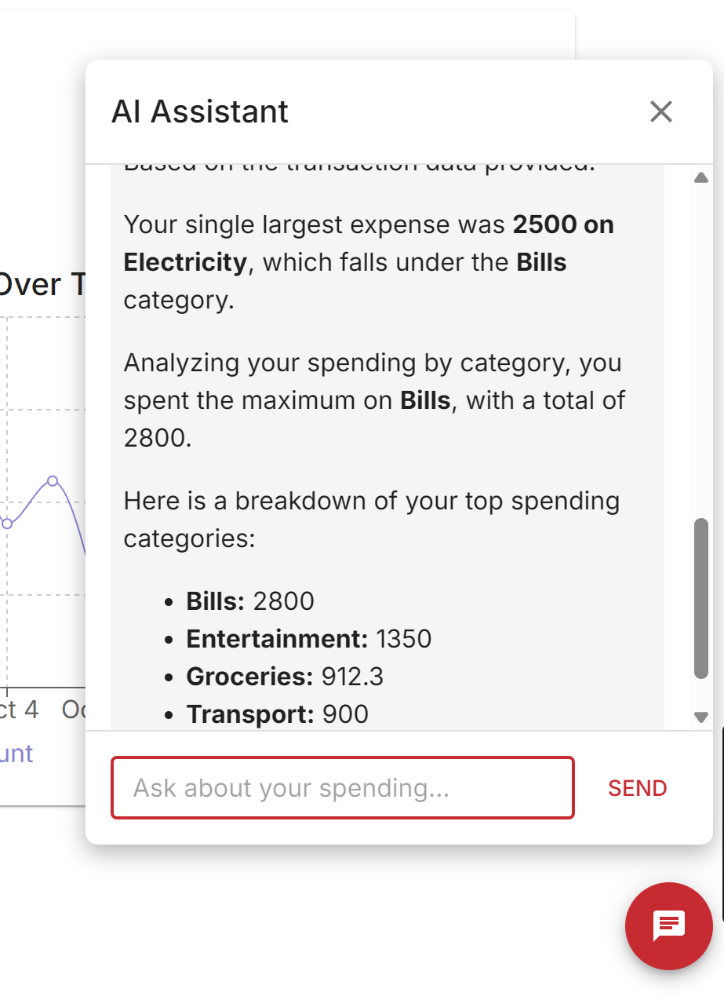

# Personal Finance Assistant

This is a personal finance management application that also uses a chat interface to help you track your expenses and income.

## Demo

Here's a quick look at how the application works:

[Click Here to watch the demo video](https://www.youtube.com/watch?v=1qld9ebNSKo)

[](https://www.youtube.com/watch?v=1qld9ebNSKo)


## Project Structure

The project is divided into two main parts:

-   `frontend/`: A React application built with Vite that provides the user interface.
-   `backend/`: A Node.js and Express server that handles the application logic, database interactions, and communication with the Google Generative AI API.

## Prerequisites

Before you begin, ensure you have the following installed:

-   [Node.js](https://nodejs.org/) (which includes npm)
-   A code editor like [Visual Studio Code](https://code.visualstudio.com/)

## Setup and Running the Application

You need to run the frontend and backend servers separately in two different terminals.

### Backend Setup

1.  **Navigate to the backend directory:**
    ```bash
    cd backend
    ```

2.  **Install dependencies:**
    ```bash
    npm install
    ```

3.  **Set up environment variables:**
    Create a `.env` file in the `backend` directory and add your Google AI Studio API key:
    ```
    GEMINI_API_KEY=YOUR_GEMINI_API_KEY
    ```
    ```
    PORT=PORT_NUMBER (e.g. 3001)
    ```
    ```
    JWT_SECRET=your_jwt_secret_key
    ```

4.  **Run the backend server:**
    ```bash
    node server.js
    ```

### Frontend Setup

1.  **Navigate to the frontend directory:**
    ```bash
    cd frontend
    ```

2.  **Install dependencies:**
    ```bash
    npm install
    ```

3.  **Run the frontend development server:**
    ```bash
    npm run dev
    ```
    The application will be accessible at `http://localhost:5173` (or another port if 5173 is busy).


## AI Assistant

This application features an intelligent AI assistant to help you manage your finances. You can interact with the assistant through a chat interface to perform various tasks, such as:

-   **Querying Your Finances:** Ask questions like, "What's my total spending this month?" or "Show me all my transactions for food."
-   **Getting Insights:** The assistant can help you analyze your spending habits and provide useful insights.

## Screenshots

Here are some screenshots of the application:


*The main chat interface where you can interact with the AI assistant.*






